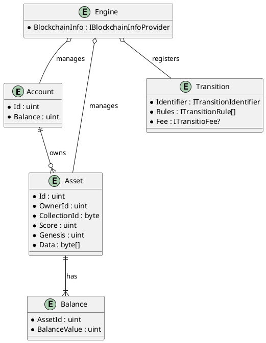
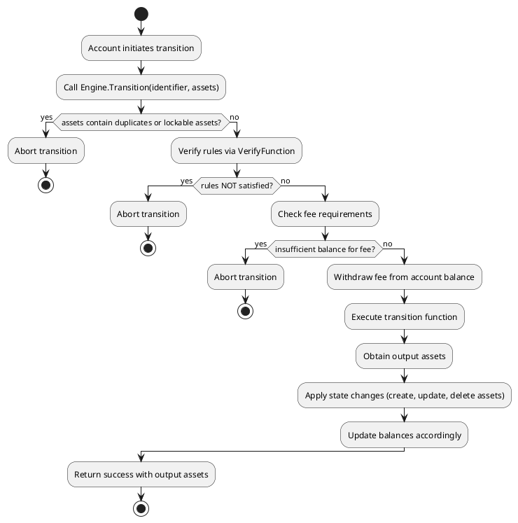

# SAGE Game Framework

The SAGE Game Framework is a modular engine designed for game state management using an asset-based, state-transition model. Instead of using a traditional database, SAGE stores state directly on "assets" (e.g., game cards), and state changes are performed by executing transitions that consume and produce assets. This architecture allows for a flexible, decentralized, and extensible game design.

## Core Concepts

- **Account:**  
  Represents a player or system account. Each account is identified by a unique ID and holds a balance.

- **Asset:**  
  The fundamental game object. Assets have an owner (`OwnerId`), a collection identifier, a score, a genesis timestamp, and a data array (often referred to as DNA) that encodes various properties using compact, bit-level operations.

- **Balance:**  
  Tracks funds for both accounts and assets. Asset-specific balances are managed separately from overall account balances.

- **Transition:**  
  A state change operation that is defined by:
  - A unique **Identifier** (encapsulated by an `ITransitionIdentifier`)
  - A set of **Rules** (implementing `ITransitionRule`)
  - An optional **Fee**
  - A **Transition Function** that computes new assets (the updated state) from the provided inputs

- **Engine:**  
  The central component that manages accounts, assets, balances, and transitions. It relies on external providers (like a blockchain info provider) for block numbers and randomness.

## Architecture Overview

The following Entity-Relationship (ER) diagram shows the relationships between the key entities:

## Transition Execution Flow

The following UML activity diagram illustrates the high-level flow of a state transition within the engine:

## Summary

By separating accounts, assets, balances, and transitions, the SAGE Game Framework provides a robust foundation for developing complex, asset-based games. Its modular design and use of state transitions make it highly adaptable for various game genres and mechanics.
